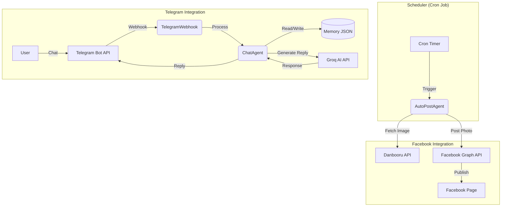

# Kei Bot - Facebook Auto-Post & Telegram Chatbot

**Kei Bot** adalah bot hybrid yang menggabungkan fitur **Facebook Auto-Poster** dengan **Telegram Chatbot**. Bot ini memiliki persona "Kei" dari Blue Archive yang bersifat *tsundere*, ditenagai oleh Groq AI.

> [!NOTE]
> Project ini adalah bagian dari **19 Juta PHP OpenSource Project**. Seluruh kode dan logika dalam project ini dibangun sepenuhnya menggunakan **PHP**.

---

## 📌 Fitur Utama

### 1. Facebook Page Auto-Poster
- **Auto-Post Greeting**: Memposting ucapan selamat pagi, siang, sore, dan malam secara otomatis sesuai jadwal.
- **Dynamic Image**: Mengambil gambar Kei (Blue Archive) secara random dari **Danbooru API** yang sesuai dengan kepribadian bot.
- **Safe Content**: Menggunakan filter `rating:safe` untuk memastikan konten yang diposting aman.

### 2. Telegram Chatbot
- **AI-Powered**: Menggunakan **Groq AI** (model Llama/Mixtral) untuk percakapan yang natural.
- **Personality**: Roleplay sebagai Kei (Blue Archive) dengan sifat *tsundere*.
- **Memory Management**: Mengingat konteks percakapan per user (disimpan di file JSON).
- **Interactive**: Support mengetik (`typing indicator`) agar terasa lebih hidup.

---

## 🏗️ Arsitektur



---

## 📋 Prasyarat

Sebelum instalasi, pastikan Anda memiliki:

1.  **Hosting/Server**: PHP 7.4+ (Support cPanel, Cron Job).
2.  **Facebook Page**:
    - Page ID
    - Access Token (Long-Lived) dengan permission `pages_manage_posts`, `pages_read_engagement`.
3.  **Telegram Bot**:
    - Bot Token (dari @BotFather).
4.  **Groq API Key**:
    - API Key dari [console.groq.com](https://console.groq.com).

---

## 📂 Struktur Project

```text
/kei-bot
├── agents/
│   ├── AutoPostAgent.php    # Logic posting FB
│   └── ChatAgent.php        # Logic chat Telegram
├── config/
│   ├── config.php           # Konfigurasi utama
│   ├── credentials.example.php # Template credentials
│   └── credentials.php      # File API Keys (RAHASIA, jangan dicommit)
├── cron/
│   ├── scheduler.php        # Script Cron Job (Auto-Post)
│   └── cleanup.php          # Script bersih-bersih memory
├── public/
│   └── telegram_webhook.php # Webhook Endpoint Telegram
├── services/
│   ├── FacebookAPI.php      # Wrapper FB Graph API
│   ├── TelegramAPI.php      # Wrapper Telegram API
│   ├── GroqAPI.php          # Wrapper Groq AI
│   └── ImageService.php     # Fetcher Danbooru
├── storage/
│   ├── logs/                # Folder log
│   └── memory/              # Folder memory chat (JSON)
└── utils/                   # Helper classes
```

---

## ⚙️ Instalasi & Konfigurasi

### 1. Setup File
Clone repository ini ke server Anda (misal ke folder `public_html/kei-bot`).

### 2. Konfigurasi Credentials
Salin file `credentials.example.php` menjadi `credentials.php`:

```bash
cp config/credentials.example.php config/credentials.php
```

Edit `config/credentials.php` dan isi dengan key Anda:

```php
<?php
putenv('FB_PAGE_ID=123456789...');
putenv('FB_ACCESS_TOKEN=EAA...');
putenv('GROQ_API_KEY=gsk_...');
putenv('TELEGRAM_BOT_TOKEN=123456:ABC...');
```

> **PENTING**: Jangan pernah commit file `credentials.php` ke git!

### 3. Setup Permission
Pastikan folder `storage` bisa ditulis oleh server (PHP):

```bash
chmod -R 777 storage
```

---

## 🚀 Deployment

### 1. Setup Webhook Telegram
Agar bot bisa membalas chat di Telegram, Anda perlu mendaftarkan URL webhook Anda.

Buka URL berikut di browser (ganti `<TOKEN>` dan `<DOMAIN>`):

```
https://api.telegram.org/bot<TOKEN_TELEGRAM>/setWebhook?url=https://<DOMAIN_ANDA>/kei-bot/public/telegram_webhook.php
```

Jika sukses, muncul respon: `{"ok":true, "result":true, ...}`.

### 2. Setup Cron Job (Untuk Auto-Post)
Agar bot bisa posting otomatis di Facebook, atur **Cron Job** di panel hosting (cPanel).

Add 4 jadwal berikut:

| Waktu | Command | Deskripsi |
| :--- | :--- | :--- |
| 06:00 | `/usr/bin/php /path/to/kei-bot/cron/scheduler.php` | Greeting Pagi |
| 12:00 | `/usr/bin/php /path/to/kei-bot/cron/scheduler.php` | Greeting Siang |
| 16:00 | `/usr/bin/php /path/to/kei-bot/cron/scheduler.php` | Greeting Sore |
| 20:00 | `/usr/bin/php /path/to/kei-bot/cron/scheduler.php` | Greeting Malam |

*(Catatan: Sesuaikan path PHP `/usr/bin/php` dengan hosting Anda)*

---

## 🧪 Testing

### Test Chatbot
1. Buka Telegram dan cari bot Anda.
2. Kirim pesan `Halo` atau `/start`.
3. Bot harus membalas dengan gaya Kei.

### Test Auto-Post (Manual)
Jalankan script scheduler secara manual via terminal SSH:

```bash
php cron/scheduler.php
```

Cek Facebook Page Anda, gambar Kei baru harusnya sudah terposting.

---

## 🐛 Troubleshooting

Jika terjadi masalah, cek file log di folder `storage/logs/`.
File log disimpan per hari, contoh: `storage/logs/2026-02-01.log`.

```bash
tail -f storage/logs/2026-02-01.log
```
